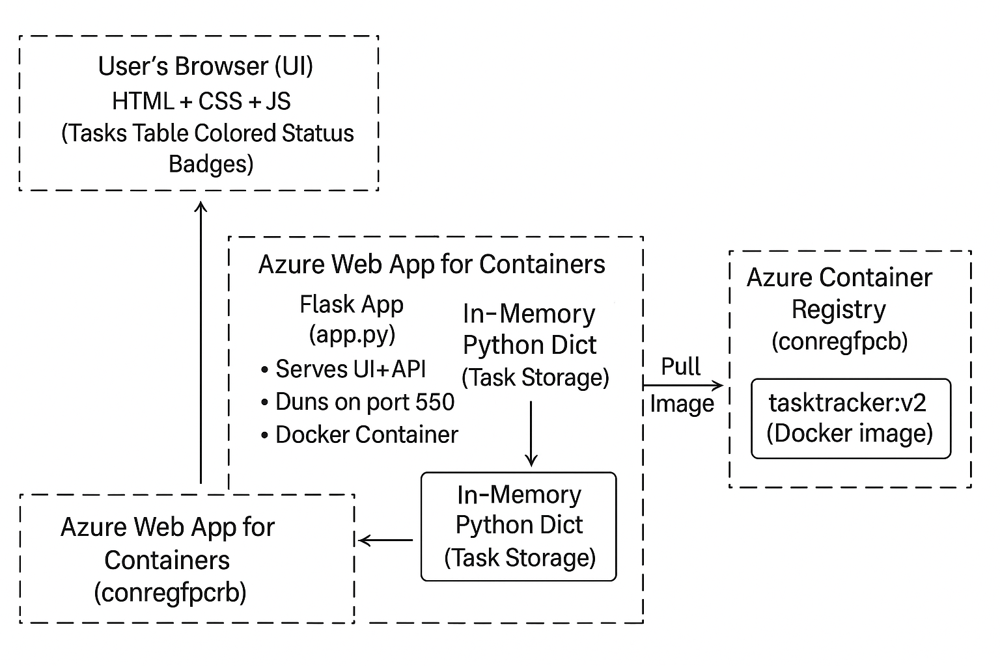
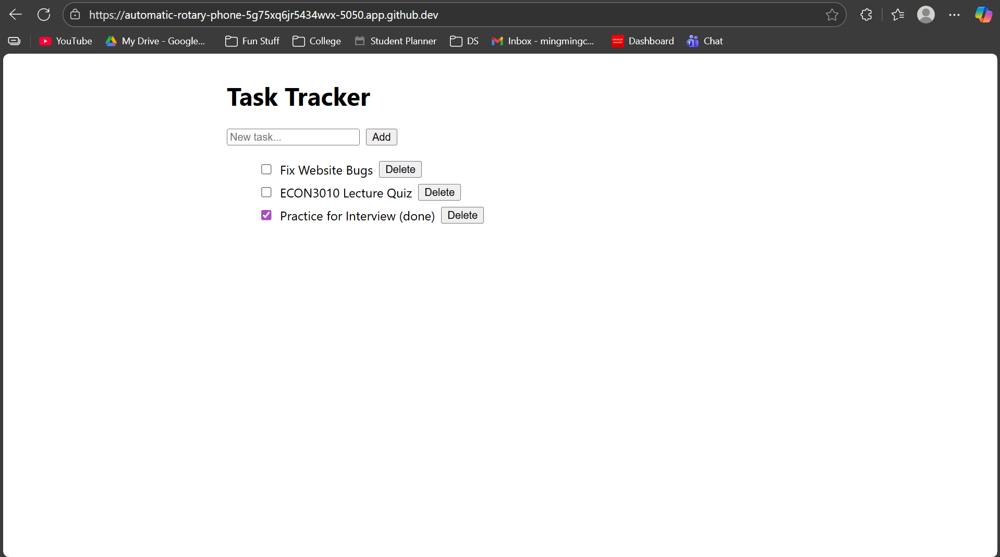

# Executive Summary
This app is for the students who have trouble keeping track of the tasks they have to do. 

This app makes it so that you can have everything on your To-Do List in one place. In the text box, you write a task that you need to get done and then press the enter button to add it to your list. After you finish the task, there is a box that you can press to check off the task. Text next to your task will say "(done)" to indicate the box is done. After that, you can also delete the task so the list doesn’t get too long. 

# System Overview
This is a minimal task management dashboard built on a Flask API, with a browser-based UI that lists tasks and lets users add, complete, and delete them. This is based on Case 1 and 4. 

Architecture Diagram:

Data/Models/Services: 
All data is stored as an in-memory Python dictionary of tasks (id, title, done) managed by the Flask API in src/app.py. The only “service” is the Flask web service itself, which is containerized with Docker and exposes REST endpoints plus a /health check.

# How to Run:
- build docker 

build -t task-tracker:latest . 

- run 

docker run --rm -p 5050:5050 --env-file .env task-tracker:latest 

- health check 

curl http://localhost:5050/health

# Design Decisions
Why this concept: Flask was lightweight, easy for containerization, and good for beginners. Alternatives considered: SQLite or MongoDB. However, they weren’t chosen 

Tradeoffs: In-memory tasks vanish on restart; simple but not persistent. 

Security/Privacy: No secrets in repo; .env.example provided; input validated. 

Ops: Logs to stdout; one-command run; known limitation = non-persistent data.

# Results & Evaluation

